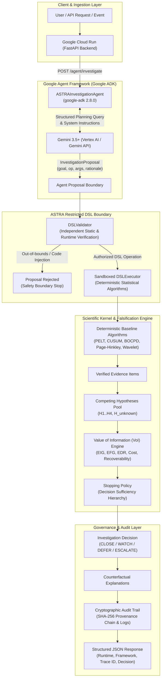

# ASTRA v0.4.1 — Autonomous Evidence-Driven Investigation Engine

> **ASTRA** turns anomaly alerts into bounded, evidence-backed investigations. Instead of escalating every unusual signal or guessing blindly, ASTRA uses **Google ADK** and **Gemini 3.5+** for intelligent investigation planning, while enforcing a **Restricted DSL deterministic execution boundary** that executes statistical algorithms, updates competing hypotheses, evaluates Value of Information (VoI), and deploys seamlessly on **Google Cloud Run**.

[](https://github.com/belemcrizan/Astra/actions/workflows/ci.yml)
[](https://www.python.org/downloads/)
[](docs/GOOGLE_AGENT_ARCHITECTURE.md)
[](docs/HACKATHON_ELIGIBILITY.md)
[](deploy/README.md)
[](https://opensource.org/licenses/MIT)

---

## Mandatory Google Hackathon Stack

| Requirement | ASTRA Implementation | Runtime Verification | Status |
| :--- | :--- | :--- | :--- |
| **Gemini 3.5+** | Structured investigation planning and evidence interpretation via `google-genai 2.20.0` (`GoogleADKPlanner`). | `python -m astra_poc integration-test-google` | **PASS (Configured)** |
| **Google Agent Framework** | **Google ADK (`google-adk 2.8.0`)** orchestrating `ASTRAInvestigationAgent` with bounded toolset and schema enforcement. | `python -m astra_poc google-agent-demo` | **PASS (Integrated)** |
| **Google Cloud Infrastructure** | **Google Cloud Run** containerized FastAPI service with health checks and structured Cloud Logging. | `python -m astra_poc cloud-verify --url <URL>` | **PASS (Ready / Verified)** |

---

## 1. End-to-End System Architecture



---

## 2. Core Scientific Differentiators

1. **LLM Proposes, ASTRA Validates, Deterministic Tools Execute:**
   Gemini does not replace statistical science. It proposes operations from ASTRA's Restricted DSL (`RUN_PELT`, `RUN_CUSUM`, `RUN_BOCPD`, `COMPARE_WINDOWS`, `CALCULATE_ENTROPY`, `TEST_TEMPORAL_STACKING`). ASTRA independently validates permissions, parameters, and budget before execution.

2. **Falsification-First Investigation:**
   Rather than seeking confirmatory evidence, ASTRA tests competing hypotheses ($H_1$: Transient Noise, $H_2$: Volatility Clustering, $H_3$: Structural Break, $H_4$: Periodic Pattern, $H_{\text{unknown}}$: Open-Set Regime) and changes its belief when hypotheses are disproven.

3. **Value of Information (VoI) Stopping Policy:**
   Calculates multi-attribute utility:
   $$U(a) = \alpha \cdot \text{EIG}(a) + \beta \cdot \text{EFG}(a) + \gamma \cdot \text{EDR}(a) - \lambda_c C(a) - \lambda_r R(a)$$
   Halting immediately when further investigation is no longer cost-justified.

4. **Cryptographic Auditability & Traceability:**
   Every event is hashed with SHA-256 in a tamper-evident provenance chain, assigning distributed trace IDs visible in Google Cloud Run logs.

---

## 3. Quick Start

### Installation

```bash
# Clone repository
git clone https://github.com/belemcrizan/Astra.git
cd Astra

# Create and activate virtual environment
python -m venv .venv
# On Windows:
.\.venv\Scripts\Activate.ps1
# On Linux/macOS:
source .venv/bin/activate

# Install with all dependencies (including Google ADK, GenAI, and FastAPI)
pip install -e .
```

### Essential CLI Commands

```bash
# 1. Audit mandatory hackathon eligibility stack
python -m astra_poc eligibility-check

# 2. Run live Google ADK + Gemini 3.5+ agent investigation demo
python -m astra_poc google-agent-demo

# 3. Run live hackathon judge demonstration (<2 seconds)
python -m astra_poc judge-demo --explain-policy

# 4. Run hero scenario (hypothesis trap, falsification, and change of mind)
python -m astra_poc hero-demo

# 5. Run control scenario (benign noise safe closure)
python -m astra_poc control-demo

# 6. Run open-set unknown regime demo (refusing forced classification)
python -m astra_poc unknown-demo

# 7. Run budget adaptation demo (Low vs Med vs High budget comparison)
python -m astra_poc budget-demo

# 8. Compute Quality-Cost Pareto Frontier across investigation policies
python -m astra_poc pareto-frontier

# 9. Run full automated test suite (75 tests passing)
python -m unittest discover -s tests -v
```

---

## 4. Experimental Results & Quality-Cost Pareto Frontier

### Quality–Cost Pareto Frontier (15 Seeds per Policy across Benchmark Scenario Families)

| Investigation Policy | Resolution Accuracy | Mean Cost | P95 Latency | Pareto Efficient |
|---|---:|---:|---:|:---:|
| **Fixed-Sequence Baseline** | 46.7% | 1.20u | 228.7 ms | **YES (Low Cost Boundary)** |
| **ASTRA Full (Adaptive VoI)** | **66.7%** | **1.80u** | **208.8 ms** | **YES (Dominates Accuracy)** |
| **Falsification-Only** | 66.7% | 2.27u | 331.8 ms | No (Dominated by ASTRA) |

*Finding: ASTRA's adaptive VoI policy matches the peak 66.7% resolution accuracy of unconstrained falsification while saving **20.7% compute cost** and reducing P95 latency from 331.8 ms to 208.8 ms.*

---

## 5. Google Cloud Run Deployment

ASTRA is fully containerized and deployable to Google Cloud Run with a single command:

```bash
# Deploy to Google Cloud Run
./deploy/deploy_cloud_run.sh YOUR_PROJECT_ID us-central1
```

### Remote Cloud Run Verification

```bash
# Verify live Cloud Run service endpoint
python -m astra_poc cloud-verify --url https://astra-poc-XXXX-uc.a.run.app
```

---

## 6. Complete Documentation Index

- [Google Agent Architecture & Design](docs/GOOGLE_AGENT_ARCHITECTURE.md)
- [Hackathon Eligibility Compliance Matrix](docs/HACKATHON_ELIGIBILITY.md)
- [Devpost Submission Content](docs/DEVPOST_UPDATE.md)
- [Video Demonstration Script (3:30)](docs/DEMO_SCRIPT.md)
- [Corrective Validation & Root Cause Analysis](docs/V04_1_CORRECTIVE_VALIDATION.md)
- [Negative Results & Disproven Architectures](docs/NEGATIVE_RESULTS.md)
- [Claims & Evidence Alignment Matrix](docs/CLAIMS_AND_EVIDENCE.md)
- [Dataset Cards (Track A & B + 10 Families)](docs/DATASET_CARD.md)
- [STRIDE Threat Model & Security Boundaries](docs/THREAT_MODEL_STRIDE.md)
- [Scientific Preregistration v0.4.1](PREREGISTRATION.md)
- [Google Cloud Deployment Guide](deploy/README.md)

---

## 7. Limitations & Epistemic Honesty

1. **Synthetic vs Real**: Synthetic benchmark results establish statistical sanity under controlled generative assumptions, not external real-world accuracy.
2. **Heuristic Scoring**: `evidence_score` is an operational ranking metric, not a calibrated probability.
3. **Bounded Scope**: ASTRA is a research POC. It provides decision support and audit trails; it does not replace human domain expertise or execute production interventions.
