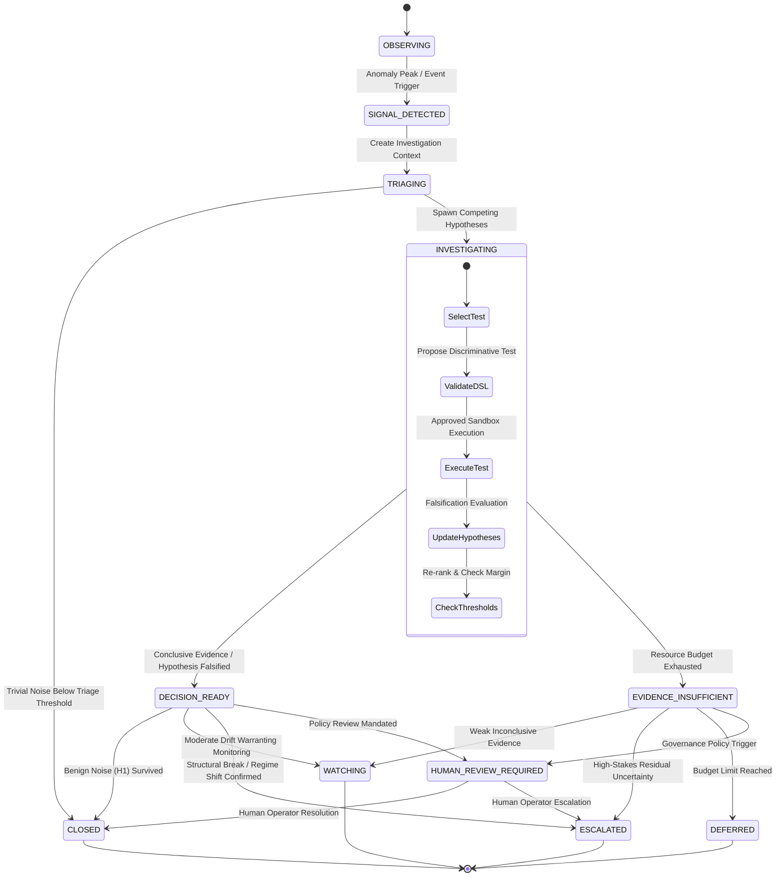

# ASTRA v0.3 — System Architecture & Execution Lifecycle

---

## 1. Architectural Philosophy

ASTRA v0.3 transitions from a passive anomaly detector to an **evidence-driven autonomous investigation engine**.

Core design principles:
1. **Bounded Autonomy**: Investigations execute strictly within computational and cost budgets (`max_steps=5`, `max_tests=6`, `max_cost_units=10.0`).
2. **Restricted Execution Boundary**: LLMs and agent planners are confined to proposing operations from a strictly typed, sandboxed DSL. Arbitrary Python execution is blocked.
3. **Competing Hypotheses & Falsification-First**: Rather than seeking confirmation for an initial guess, ASTRA maintains multiple competing hypotheses and deliberately attempts to disprove them before escalating.
4. **Epistemic Modesty**: `evidence_score` is explicitly defined as an uncalibrated heuristic ranking (0.0 to 1.0), never a probability. Controlled synthetic benchmarks (Track A) are strictly separated from real-world empirical observations (Track B).

---

## 2. High-Level Architecture Diagram

```text
                  +-----------------------------------+
                  |   Event Stream / Ingestion Source |
                  |   (Track A Synthetic / Track B)   |
                  +-----------------+-----------------+
                                    |
                                    v
                  +-----------------------------------+
                  |         Signal & Regime Gate      |
                  |  (Robust Z-score / Preliminary)   |
                  +-----------------+-----------------+
                                    | Anomaly Detected
                                    v
                  +-----------------------------------+
                  |    Investigation State Machine    |
                  |  (Formal Transition Enforcement)  |
                  +-----------------+-----------------+
                                    |
            +-----------------------+-----------------------+
            |                                               |
            v                                               v
+-----------------------+                       +-----------------------+
|    Hypothesis Pool    |                       |  Evidence Acquisition |
| (H1, H2, H3, H4, H_u) |                       | (Discriminative Info) |
+-----------+-----------+                       +-----------+-----------+
            |                                               |
            +-----------------------+-----------------------+
                                    |
                                    v
                  +-----------------------------------+
                  |        Investigation Planner      |
                  |    (Gemini API / Local Sandbox)   |
                  +-----------------+-----------------+
                                    | Proposes DSL Operation
                                    v
                  +-----------------------------------+
                  |           Restricted DSL          |
                  |     Schema & Grammar Definition   |
                  +-----------------+-----------------+
                                    |
                                    v
                  +-----------------------------------+
                  |           DSL Validator           |
                  |  (Security & Budget Enforcement)  |
                  +--------+-----------------+--------+
                           | Valid           | Rejected
                           v                 v
            +-----------------------+   +-----------------------+
            |      DSL Executor     |   | Safe Fault Recovery   |
            | (Sandboxed Execution) |   +-----------------------+
            +-----------+-----------+
                        | Test Results
                        v
            +-----------------------+
            | Falsification Engine  |
            |  (Disprove / Update)  |
            +-----------+-----------+
                        | Updated Scores
                        v
            +-----------------------+
            |    Decision Policy    |
            | (CLOSE / WATCH / ESC) |
            +-----------+-----------+
                        |
            +-----------+-----------+
            |                       |
            v                       v
      Human Review            Audit Trail Package
       Escalation             (.json / .md / .jsonl)
```

---

## 3. Investigation State Machine



---

## 4. Competing Hypotheses Framework

| Hypothesis | Name | Claim | Primary Discriminator |
|---|---|---|---|
| **H1** | Transient Statistical Fluctuation | Anomaly is an isolated random noise outlier with no structural shift. | Sub-window contrast test (`COMPARE_WINDOWS`) & optimal segmentation (`RUN_PELT`). |
| **H2** | Gradual Regime Change | Persistent transition in baseline mean or volatility clustering. | Local variance shift & fluctuation susceptibility (`CHECK_SUSCEPTIBILITY`). |
| **H3** | Abrupt Structural Break | Discrete parameter collapse at a sharp boundary. | Bayesian online change-point detection (`RUN_BOCPD`) & PELT exact partitioning. |
| **H4** | Coordinated Weak Signal | Repeated subtle temporal pattern aligned with discrete events. | Temporal null stacking (`TEST_TEMPORAL_STACKING`) with 999 circular shifts. |
| **H_unknown** | Unmodeled / Exogenous Anomaly | Complex dynamics outside standard parametric models. | Macroscopic Shannon entropy differential (`CALCULATE_ENTROPY`) & volume profiles. |

---

## 5. Restricted DSL Specification

| Operation | Arguments | Cost | Expected Information Power |
|---|---|---:|---|
| `RUN_CUSUM` | `drift`, `threshold`, `cooldown` | 1.0 | High against volatility drift (H1 vs H2). |
| `RUN_PAGE_HINKLEY` | `delta`, `threshold`, `cooldown` | 1.0 | High against cumulative mean shifts (H1 vs H2/H3). |
| `RUN_PELT` | `minimum_segment`, `bic_multiplier` | 2.0 | Exact partitioning; discriminates discrete breaks from noise. |
| `RUN_BOCPD` | `hazard_lambda`, `minimum_mode_drop`, `minimum_separation` | 3.0 | MAP run-length collapse; discriminates gradual vs abrupt breaks. |
| `COMPARE_WINDOWS` | `window_size`, `center_idx`, `stat` | 1.0 | Direct local contrast around suspected anomaly. |
| `CALCULATE_ENTROPY` | `bins` | 0.5 | Disordered partition measurement. |
| `CHECK_SUSCEPTIBILITY`| `num_windows` | 0.5 | Extensive variance ratio across segments. |
| `TEST_TEMPORAL_STACKING`| `permutations`, `alpha` | 2.5 | Empirical temporal null test under circular time-shift. |
| `REQUEST_FEATURE` | `feature_name` | 0.5 | Secondary telemetry extraction (volume, price, autocorrelation). |
| `RECOMMEND_DECISION`| `decision`, `reason_code` | 0.0 | Meta-action proposing investigation conclusion. |
