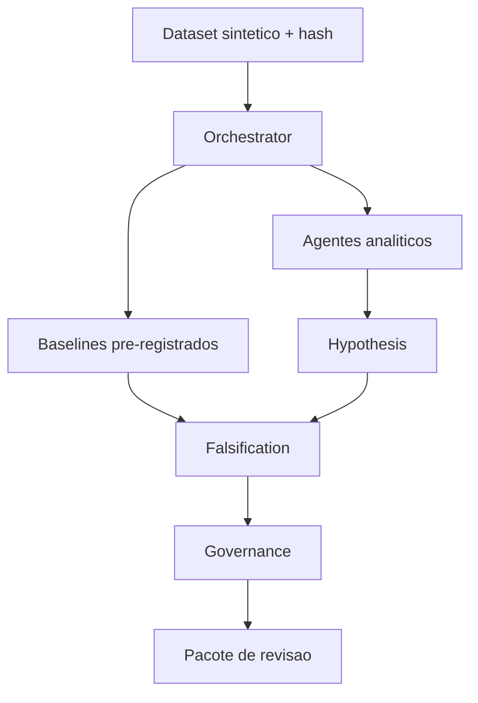

# Arquitetura e fases futuras

## Dois planos, mas apenas um implementado

O plano deterministico existe e permanece como fonte numerica: Signal, Regime, Physics, Graph e Response. Hypothesis e Falsification ainda sao deterministas na v0.2.

O futuro plano LLM nao podera emitir numeros nem Python arbitrario. Ele devera produzir uma DSL com operador permitido, entradas, estatistica, nulo, alpha e criterio de falsificacao. O executor deterministico validara e executara o contrato em sandbox.

## Fluxo

## Multicloud futuro

O benchmark entre AWS, Azure e GCP deve usar a mesma imagem OCI, dataset, semente, limites de CPU/memoria e janela de medicao. Timestamps, UUIDs e pequenas variacoes de ponto flutuante devem ser normalizados; o criterio correto e paridade semantica, nao igualdade bit a bit.

Experimentos futuros: portabilidade de container, orquestradores nativos sob falha injetada e plano LLM gerenciado. A escolha dependera de residencia, IAM, integracao, custo e SLA, nao de um “vencedor universal”.

## Computacao quantica

Nao integra o roadmap operacional. So deve aparecer como experimento isolado depois que existir um subproblema formal, um gargalo classico demonstrado e uma hipotese mensuravel de vantagem.

