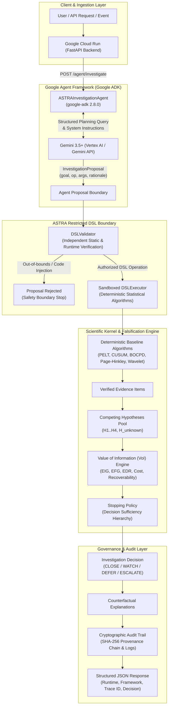

# ASTRA Google Agent Architecture

## Google ADK + Gemini 3.5+ on Google Cloud Run

ASTRA implements a strict, security-hardened division of labor between generative AI and deterministic decision science:

> **Google ADK orchestrates Gemini 3.5+ as an investigation-planning agent; Gemini proposes diagnostic operations, ASTRA's restricted deterministic boundary validates and executes them, and the entire backend runs on Google Cloud Run.**

---

## 1. End-to-End System Architecture



---

## 2. Role Separation: Generative vs Deterministic

| Responsibility | Handled By | Guarantees / Enforcement |
| :--- | :--- | :--- |
| **Investigation Intent & Planning** | **Gemini 3.5+ (via Google ADK)** | Synthesizes anomaly context, reasons over active competing hypotheses, and proposes next diagnostic actions. |
| **Tool Orchestration** | **Google ADK (`google-adk 2.8.0`)** | Manages agent loop, system instructions, structured output schemas (`InvestigationProposal`), and bounded tool interfaces. |
| **Execution Permission & Safety** | **ASTRA DSL Validator** | Strictly blocks arbitrary Python, shell commands, out-of-range parameters, and budget violations before execution. |
| **Statistical Computation** | **ASTRA Sandboxed Executor** | Executes deterministic algorithms (`PELT`, `CUSUM`, `BOCPD`, `COMPARE_WINDOWS`, `CALCULATE_ENTROPY`, `TEST_TEMPORAL_STACKING`). |
| **Evidence Generation** | **Deterministic Algorithms** | Evidence statements are produced purely by statistical kernels; LLM cannot fabricate or alter evidence. |
| **Hypothesis Updating** | **Competing Hypothesis Pool** | Updates hypothesis evidence scores and tracks $H_{\text{unknown}}$ open-set dynamics. |
| **Stopping & Decision Policy** | **ASTRA Stopping Policy** | Evaluates stopping precedence (`DECISION_SUFFICIENT`, `UNKNOWN_DOMINANT`, `BUDGET_EXHAUSTED`) and issues final decision. |
| **Hosting & Scalability** | **Google Cloud Run** | Fully managed containerized HTTP execution listening on `$PORT` with structured Cloud Logging. |

---

## 3. Google ADK Bounded Toolset

The ADK Agent interacts with ASTRA exclusively through six bounded tools:

```python
# 1. Inspect state machine and budget
get_investigation_state() -> dict

# 2. Inspect active competing hypotheses and evidence scores
get_competing_hypotheses() -> list[dict]

# 3. List allowed, unexecuted DSL operations from catalog
get_available_experiments() -> list[dict]

# 4. Propose diagnostic operation with structured rationale
propose_investigation_action(op_name, args, target_hypotheses, rationale) -> dict

# 5. Execute approved DSL operation in sandboxed kernel
execute_bounded_experiment(op_name, args) -> dict

# 6. Retrieve final policy outcome and audit trail
get_investigation_result() -> dict
```

---

## 4. Prompt-Injection & Untrusted Input Boundary

External analyst notes, multimodal charts, and user-supplied data are classified as **UNTRUSTED INPUT**:
1. External text is strictly isolated in data structures.
2. System instructions forbid Gemini from executing code or altering DSL rules.
3. Every proposal passes through static typing and runtime validation in `DSLValidator`.
4. If a prompt attempt seeks to inject unauthorized code (e.g. `eval`, `os.system`), `DSLValidator` rejects it immediately with `status: rejected`.

---

## 5. Google Cloud Run Runtime Detection

ASTRA automatically discovers its execution runtime by inspecting Google Cloud Run metadata:
- If environment variables `K_SERVICE`, `K_REVISION`, or `K_CONFIGURATION` are present, `runtime` is reported as **`Google Cloud Run`**.
- Otherwise, `runtime` is reported as **`local`**.

Structured JSON logs are emitted on `sys.stdout` adhering to Google Cloud Logging formats:
```json
{
  "event": "astra_investigation_completed",
  "trace_id": "trace-90513d038d4a",
  "case_id": "cloud-case-hero-42",
  "runtime": "Google Cloud Run",
  "agent_framework": "Google ADK",
  "model": "gemini-2.5-flash",
  "executed_ops": ["COMPARE_WINDOWS", "RUN_PELT"],
  "stop_reason": "DECISION_SUFFICIENT",
  "decision": "ESCALATE",
  "latency_ms": 248.5
}
```
