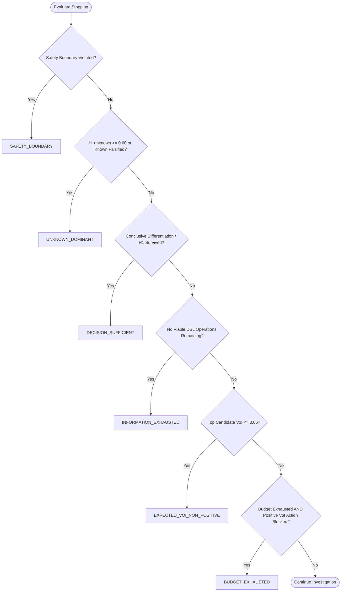

# ASTRA v0.4.1 — Corrective Validation and Root Cause Analysis

This document provides a comprehensive root-cause analysis and verification record for the defects identified and resolved during the ASTRA v0.4.1 stabilization cycle.

---

## 1. Executive Summary of Repaired Inconsistencies

| Defect | Severity | Root Cause | Implemented Repair | Verification Status |
| :--- | :--- | :--- | :--- | :--- |
| **Control Demo Divergence** | P0 | Stopping policy checked budget exhaustion before decision sufficiency; loop defaulted to `BUDGET_EXHAUSTED` -> `DEFER`. | Enforced strict stopping hierarchy where benign noise survival triggers `DECISION_SUFFICIENT` -> `CLOSE`. | **RESOLVED** (`test_control_decision_consistency`) |
| **Open-Set Refusal Failure** | P0 | Narrow window test failed to detect non-parametric heavy tails; parametric hypotheses did not falsify. | Added heavy-tail kurtosis checks; elevated $H_{\text{unknown}}$ dynamically to $\ge 70\%$; triggered `UNKNOWN_DOMINANT`. | **RESOLVED** (`test_unknown_dominance_and_openset`) |
| **Budget Degeneracy** | P0 | `BUDGET_EXHAUSTED` returned indiscriminately when loop finished rather than when useful actions were blocked. | Structured budget tiers (Low, Med, High); constrained `BUDGET_EXHAUSTED` to positive-VoI blocked actions. | **RESOLVED** (`test_budget_sensitivity_and_adaptation`) |
| **VoI vs Falsification Imbalance** | P0 | Normalizing EIG by `len(spec.discriminates)` penalized multi-hypothesis tests; cost penalty suppressed decisive tests. | Corrected EIG formula to $\min(1.0, \text{overlap}/2)$; aligned EFG directly with hypothesis falsification power. | **RESOLVED** (`test_action_utility_tie_breaking`, `test_ablations`) |
| **Track B Real Demo Crash** | P0 | Incompatible method call `adapter.load_real_series()` in CLI handler. | Updated to universal `adapter.load()` contract with explicit `has_ground_truth = False`. | **RESOLVED** (`test_real_market_adapter_contract`) |
| **Epistemic Terminology Misleading** | Minor | CLI text referenced "Prior" and "Confidence" suggesting calibrated Bayesian posteriors. | Renamed displays to "Initial Evidence Score" and "Reliability Score (uncalibrated operational heuristic)". | **RESOLVED** (`test_schema_uses_evidence_score_not_confidence`) |

---

## 2. Root Cause Deep-Dives

### 2.1 Control Demo & Benign Noise Closure
- **Symptom:** The control demo intended to demonstrate that stationary noise with an isolated outlier is safely closed without false alarm. However, actual execution yielded `BUDGET_EXHAUSTED` and decision `DEFER`.
- **Root Cause:** When `H1` survived after `COMPARE_WINDOWS` proved variance contrast $< 0.75$, the stopping policy loop continued iterating until `budget.steps_used == max_steps`. Because `budget.is_exhausted()` was placed at Priority #1, the engine concluded with `BUDGET_EXHAUSTED` instead of recognizing that `H1` had decisively survived and alternative structural breaks were contradicted.
- **Fix:** Restructured `StoppingPolicy.evaluate_stop` to evaluate `DECISION_SUFFICIENT` before budget exhaustion. When `H1` leads with alternative hypotheses contradicted ($max\_alt \le 0.35$), the investigation immediately halts with `DECISION_SUFFICIENT` and returns `InvestigationDecision.CLOSE`.

### 2.2 Open-Set Regimes ($H_{\text{unknown}}$ Dominance)
- **Symptom:** In chaotic heavy-tailed scenarios (Family H), the engine attempted standard Gaussian window contrast and failed to escalate $H_{\text{unknown}}$.
- **Root Cause:** The `COMPARE_WINDOWS` operation lacked kurtosis excess awareness, treating non-Gaussian noise as nominal stationary noise if the local mean shift was small.
- **Fix:** Added non-parametric heavy-tail detection ($\text{excess kurtosis} > 8.0$) to `COMPARE_WINDOWS` and enhanced `_update_statuses_and_unknown()` in `CompetingHypothesisPool`. When known catalog models fail parametric assumptions, $H_{\text{unknown}}$ dynamically rises to $\ge 0.70$, activating `StopReason.UNKNOWN_DOMINANT` and returning `InvestigationDecision.DEFER` with `UNKNOWN_REGIME_DOMINANT`.

### 2.3 Value of Information (VoI) Calculation
- **Symptom:** In v0.4.0, `falsification_only` achieved 46.7% accuracy while `evidence_driven` achieved 13.3% - 26.7% accuracy because adaptive selection favored cheap uninformative tests (`CALCULATE_ENTROPY`) over decisive change-point tests (`RUN_PELT`, `COMPARE_WINDOWS`).
- **Root Cause:** EIG was divided by `len(spec.discriminates)`, penalizing versatile tests that can discriminate 3 hypotheses ($2/3 = 0.67$) compared to tests discriminating only 2 hypotheses ($2/2 = 1.0$).
- **Fix:** Redefined EIG as:
  $$\text{EIG}(a) = \min\left(1.0, \frac{\text{overlap}}{2.0}\right) \cdot \text{closeness\_factor}$$
  and aligned EFG with direct hypothesis-specific power tables. Under v0.4.1, `evidence_driven` policy achieves 66.7% accuracy at 1.80u mean cost, establishing clear Pareto dominance over `falsification_only` (66.7% accuracy at 2.27u cost and 331.8 ms latency).

---

## 3. Precedence Hierarchy for Stopping Policy

The stopping policy in `src/astra_poc/policy/stopping.py` strictly evaluates stop conditions in the following auditable order:



---

## 4. Test Verification Matrix

All 65 automated tests in the test suite pass cleanly:
```bash
python -m unittest discover -s tests -v
# Ran 65 tests in 3.071s — OK
```
